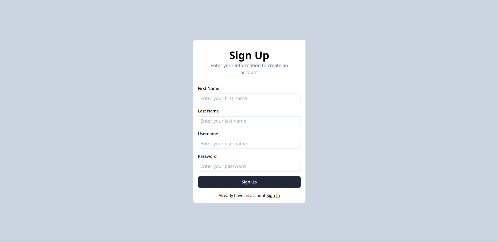
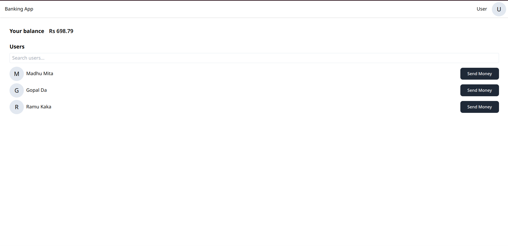
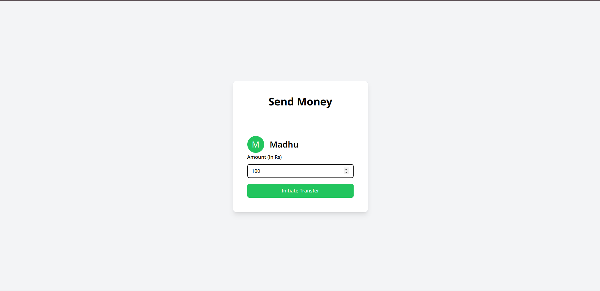

# Basic Banking application


This is a basic full stack banking application built using JavaScript, Node.js, React, Tailwind CSS, and Axios. The application allows users to sign up, sign in, view all users, and send money to other users.

## Features

- Signup, Signin
- Dashbaord
- Sendmoney to other user

## Preview





## Getting Started

To run this project locally, follow these steps.

### Prerequisites

Make sure you have **Node.js** and **npm** installed on your machine.

- [Node.js](https://nodejs.org/en/download/)
- [npm](https://www.npmjs.com/get-npm) 

### Setup

1. **Clone the repository**:

   ```bash
   git clone https://github.com/kundusubrata/basic-banking-app.git
   cd basic-banking-app
   ```
2. ****Install dependencies and Run the project locally:**
	- For the backend:
	```bash
	cd backend
	npm install
	```
	- For the Frontend:
	```bash
	cd frontened
	npm install
	```
3. **Configure Environment Variables:**
Create a `config.env` file in the `config` directory within the `backend` folder, and set the required environment variables.
	```bash
	PORT=3000
	DB_URL=your_db_url
	JWT_SECRET=your_secret_key
	JWT_EXPIRES_TIME=7d
	COOKIE_EXPIRES_TIME=7
	```
4. **Start the Backend Server**
	In the backend directory, run:
	```bash
	npm start run
	```
5. **Start the Frontend Application**
	In the frontend directory, run:
	```bash
	npm run dev
	```
6. **Open in Browser**
	Open your browser and navigate to `http://localhost:5173` to view the application.
